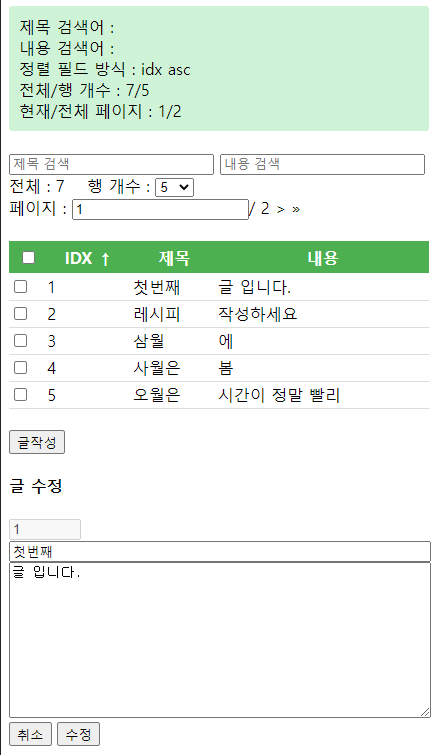

# SimpleBoard_v2
CodeIgniter 와 Vue.js 학습을 위한 심플게시판 v2 입니다.
- 검색기능 추가
- 정렬기능 추가
- 페이징 추가
- 복수 선택 후 삭제


# 요구사항
1. PHP + MySQL (MariaDB) 환경을 요구합니다.
2. CodeIgniter 3.x 를 다운받아 웹호스팅 환경을 준비합니다. Vue.js 2.x 은 포함되어 있습니다.

3. 데이타베이스에 아래 쿼리로 테이블 생성합니다.
```mysql
CREATE TABLE `board` (`idx` int(10) NOT NULL AUTO_INCREMENT,`subject` varchar(50) NOT NULL,`content` text NOT NULL,PRIMARY KEY(`idx`)) DEFAULT CHARSET=utf8;
```

4. application/config/database.php 파일에 DB 접속정보 기입
5. application/config/config.php 파일에서 base_url 설정
6. application/config/routes.php 파일에서 $route[‘default_controller’] = ‘board/index’;  와 같이 설정
7. application/config/autoload.php 파일에서
```php
    $autoload[‘helper’] = array(‘url’); 수정
    $autoload[‘libraries’] = array(‘database’); 수정
```

8. 홈페이지 최상위 디렉토리에 assets/js 디렉토리 생성 후 vue.min.js, axios.min.js 파일 저장합니다.


# 미리보기

